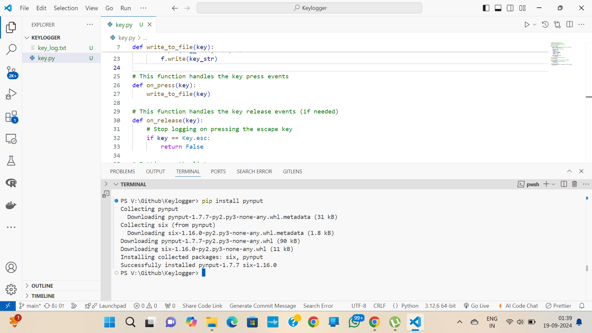
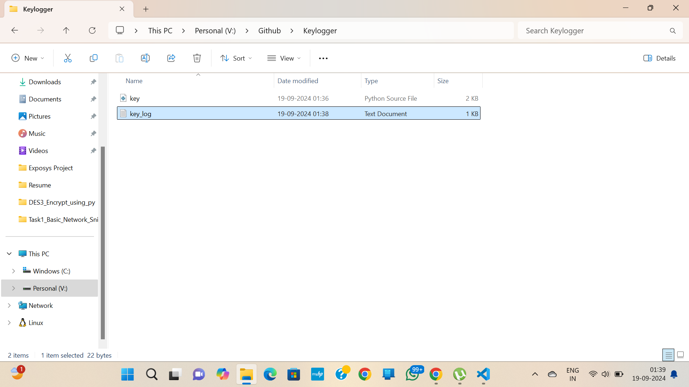
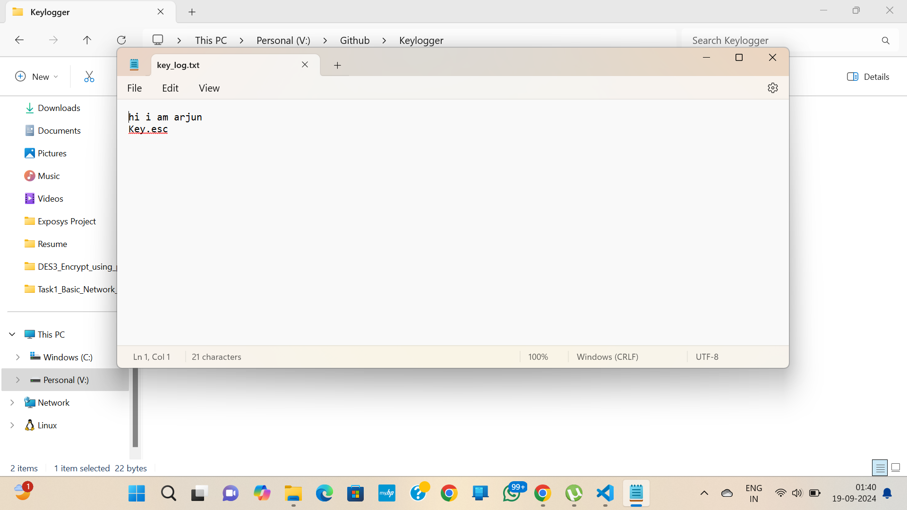

# Python Keylogger

This is a simple keylogger built using Python and the `pynput` library. It captures all keystrokes and logs them into a text file (`key_log.txt`). This project is for **educational purposes only** and demonstrates how keyloggers function in the context of cybersecurity. **Use it responsibly and ethically.**

## Demostration :





## Features

- Logs all keystrokes, including special keys (`Space`, `Enter`, `Backspace`, etc.).
- Stores the logs in a plain text file (`key_log.txt`).
- Stops logging when the `Esc` key is pressed.
- (Optional) Timestamps can be added for each keystroke.

## Requirements

- Python 3.x
- `pynput` library

## Installation

1. Clone the repository or download the source code.

```
git clone https://github.com/yourusername/python-keylogger.git
```

2. Install the required library:

```
pip install pynput
```

3. Run the keylogger script:

```
python keylogger.py
```

## Usage
- Once executed, the keylogger will start capturing keystrokes.
- All keystrokes will be logged to key_log.txt in the same directory.
- Press the Esc key to stop the keylogger.

## Ethical Considerations
- This keylogger is for educational and personal use only. Unauthorized use of keyloggers is illegal and unethical. Make sure to use this project responsibly, and only monitor systems you own or have explicit permission to use.
